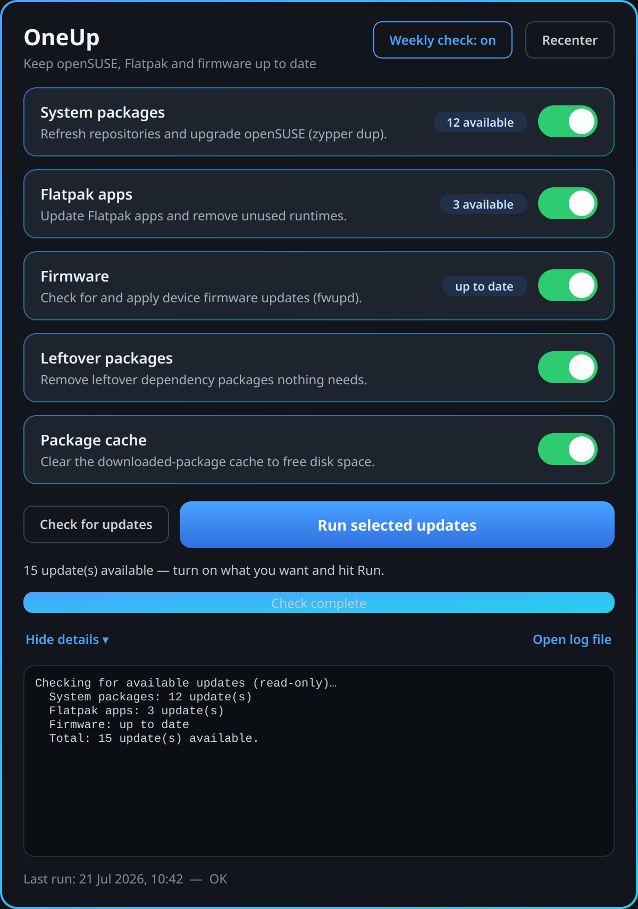

# OneUp

**One click, everything up to date.** A small, no-nonsense update dashboard for
openSUSE (Tumbleweed and Leap) that does the four things you actually need — in
the *right* way — from a single window.



---

## Why not just use Discover?

Because keeping openSUSE current means running several different commands, and the
graphical tools don't cover all of them:

- **Discover / PackageKit** handles packages and Flatpaks, but on Tumbleweed it
  regularly chokes on Packman codec **vendor changes** — the update stalls and you
  end up in a terminal anyway. It also doesn't touch firmware or clean up orphans.
- The **correct** Tumbleweed system-update command is `zypper dup --allow-vendor-change`.
  Plenty of people run plain `zypper up` instead and slowly break their system.
- Firmware (`fwupd`), Flatpak clean-up, and leftover-package removal are three more
  separate commands most people never run.

OneUp bundles all of that behind toggles and runs each step the way openSUSE's own
documentation recommends. It's the knowledge, not the GUI, that's the point.

## What it does

| Task | What runs |
|------|-----------|
| **System packages** | `zypper dup --allow-vendor-change` (Tumbleweed) or `zypper update` (Leap), after a repo refresh |
| **Flatpak apps** | `flatpak update` for both user and system scope, then prunes unused runtimes |
| **Firmware** | `fwupdmgr refresh` + `update` |
| **Leftover packages** | Safely autoremoves unneeded dependencies; *reports* (never auto-removes) hand-installed orphans |
| **Package cache** | `zypper clean --all` to reclaim disk space |

Each task is a toggle — turn off what you don't want. There's a live log, a
one-click **Restart** button when a reboot is genuinely needed, and a run history.

## Design notes

- **OneUp never runs as root.** The GUI is a thin front-end; all privileged work
  happens in `update_system.sh`, which authenticates **once** through your desktop's
  standard password prompt and keeps the credential warm for the run.
- **It gets PackageKit out of the way.** The desktop's background updater grabs the
  package lock shortly after login; OneUp stops it first so `zypper` can work, and
  it restarts on its own afterwards.
- **A failed step never claims success.** The reboot advice only appears when
  something was actually installed, or when `zypper needs-rebooting` explicitly says
  so — not when a step merely errored out.
- **The engine is usable on its own.** `update_system.sh` runs fine in a plain
  terminal (`./update_system.sh --steps=system,cache`); the GUI just drives it.

## Install & run

### From source (any openSUSE with KDE / Qt)

Requires Python 3 and PySide6:

```bash
sudo zypper install python3-PySide6
git clone https://github.com/milnet01/OneUp.git
cd OneUp
python3 updater.py
```

### As a Flatpak

A Flatpak manifest lives in `flatpak/`. See that folder's notes for building and
installing locally. *(Flatpak packaging of a host-system updater has some
sandbox-permission caveats — documented there.)*

## Requirements

- openSUSE Tumbleweed or Leap
- `zypper` (always present), and optionally `flatpak` and `fwupd` — steps for tools
  you don't have are skipped cleanly
- Python 3 + PySide6 (Qt 6) for the GUI
- A polkit/askpass agent for the password prompt (standard on KDE and GNOME)

## Licence

MIT — see [LICENSE](LICENSE). Icon uses the Material "refresh" glyph.
