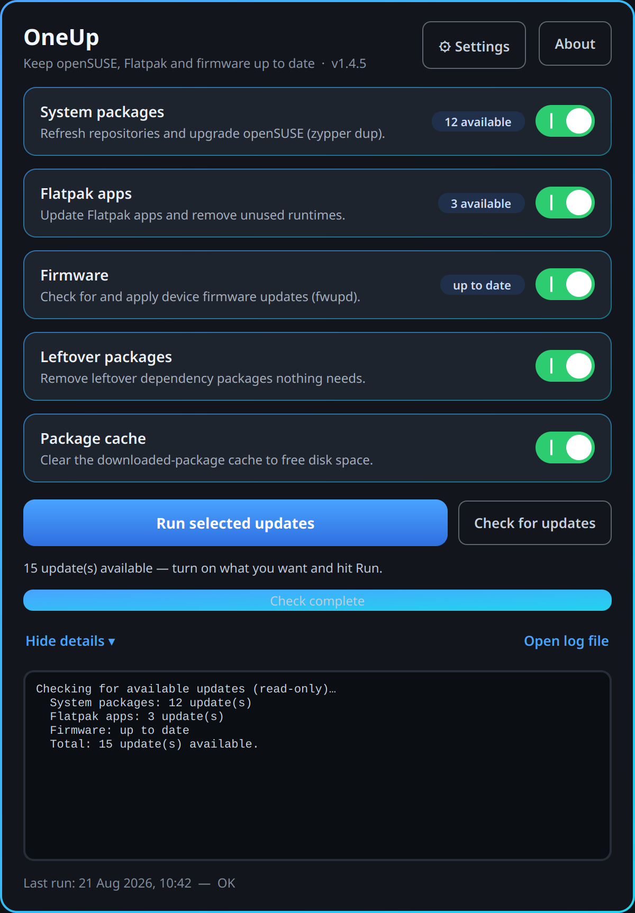

# OneUp

**One click, everything up to date.** A small, no-nonsense update dashboard for
openSUSE (Tumbleweed and Leap) that does the five things you actually need — in
the *right* way — from a single window.



---

## Why not just use Discover?

Because keeping openSUSE current means running several different commands, and the
graphical tools don't cover all of them:

- **Discover / PackageKit** handles packages and Flatpaks, but on Tumbleweed it
  regularly chokes on Packman codec **vendor changes** — the update stalls and you
  end up in a terminal anyway. It also doesn't touch firmware or clean up orphans.
- The **correct** Tumbleweed system-update command is `zypper dup --allow-vendor-change`.
  Plenty of people run plain `zypper up` instead and slowly break their system.
- Firmware (`fwupd`), Flatpak clean-up, and leftover-package removal are three more
  separate commands most people never run.

OneUp bundles all of that behind toggles and runs each step the way openSUSE's own
documentation recommends. It's the knowledge, not the GUI, that's the point.

## What it does

| Task | What runs |
|------|-----------|
| **System packages** | `zypper dup --allow-vendor-change` (Tumbleweed) or `zypper update` (Leap), after a repo refresh |
| **Flatpak apps** | `flatpak update` for both user and system scope, then prunes unused runtimes |
| **Firmware** | `fwupdmgr refresh` + `update` |
| **Leftover packages** | Safely autoremoves unneeded dependencies; *reports* (never auto-removes) hand-installed orphans |
| **Package cache** | `zypper clean --all` to reclaim disk space |

Each task is a toggle — turn off what you don't want. On top of running updates,
OneUp can:

- **Check for updates** read-only (see the count per task before installing).
- **See how big the download is** before you start. **Show download size** on the
  system task works out the exact figure, so you know whether you're in for 40 MB
  or 2 GB before you commit to it — useful on a slow or metered connection.
- **Check weekly in the background** and notify you when updates are ready.
- **Sit quietly in the system tray** and turn amber when updates are waiting, so you
  notice without catching a popup — with a right-click Check / Update / Open / Quit
  menu. Optional (off by default), and can also start at login.
- **Update automatically every week** — optionally (off by default). An "Automatic
  updates" setting runs the whole update on a weekly schedule in the background,
  keeping the snapshot/rollback safety net. It needs the "Passwordless" setting, so
  an unattended run doesn't stop to ask for a password — and if that setting ever
  stops working, the weekly update switches itself off and tells you, rather than
  quietly doing nothing every week.
- **Restart just the affected services** instead of rebooting, when a full reboot
  isn't actually required.
- **Survive a single broken software source** instead of failing the whole update —
  sets just that source aside, updates everything else, and retries it next time.
- **Retry only the steps that failed**, rather than running the whole thing again.
- **Manage your software sources** without opening a terminal — see what's switched
  on, turn one off, or remove it entirely, which is what you want when a
  third-party source is the thing causing trouble.
- **Roll back** to the snapshot it took before the update, in one click.
- **Skip the password prompt** — optionally (off by default). A "Passwordless"
  toggle stops OneUp asking for your password on every update. It stores **no
  password**: the system just remembers the decision for OneUp's update commands,
  and switching it off revokes it instantly. The one exception is firmware, which
  asks the system for permission its own way and may still show a prompt.
- **Explain failures** in plain English, warn about low disk space or duplicate
  repos before starting, and follow your desktop's **light/dark** theme — or take one of
  **eight colour themes** you pick yourself.

There's a live log, a one-click **Restart** button when a reboot is genuinely
needed, and a run history.

## Design notes

- **OneUp never runs as root.** The GUI is a thin front-end; all privileged work
  happens in `update_system.sh`, which authenticates **once** through your desktop's
  standard password prompt and keeps the credential warm for the run.
- **It gets PackageKit out of the way.** The desktop's background updater grabs the
  package lock shortly after login; OneUp stops it first so `zypper` can work, and
  it restarts on its own afterwards.
- **A failed step never claims success.** The reboot advice only appears when
  something was actually installed, or when `zypper needs-rebooting` explicitly says
  so — not when a step merely errored out.
- **An update is never cut off half-way.** Stop asks the update to finish the step it's
  on and then stop — it doesn't kill it mid-install, because a half-applied package
  transaction is how you end up with broken programs. For the same reason, closing OneUp
  doesn't abort a running update: it carries on in the background and finishes properly,
  and OneUp warns you before you close so this isn't a surprise. Reopen it and you'll be
  shown that run's live progress again.
- **A slow server never looks like a crash.** Some mirrors are painfully slow — one served
  an update index at under 1 KB/s. `zypper` says nothing at all while it waits, so the app
  used to look frozen for minutes at a time. OneUp now shows which source it's fetching and
  how far through the list it is, the download size and speed, and how long it's been
  waiting — and says so plainly when nothing has arrived for a while. It also stops waiting
  on any one source after two minutes and offers to leave it out, rather than sitting there
  for hours.
- **The engine is usable on its own.** `update_system.sh` runs fine in a plain
  terminal (`./update_system.sh --steps=system,cache`); the GUI just drives it.

## Accessibility

OneUp is built to be usable if you can't see the screen well — or at all.

- **Screen readers.** Every control has a spoken name, so nothing announces as an
  unlabelled button, and the task switches report their on/off state. Progress is
  spoken as it happens ("Updating system packages, step 1 of 3"), along with each
  step's outcome and the final summary. The update log is *not* read aloud — a run
  prints hundreds of lines — but it is a named, focusable text area you can read at
  your own pace.
- **Bigger text.** OneUp follows your desktop's font-size setting automatically.
  **Settings → Text size** enlarges it further (Normal / Large / Larger), applied
  instantly.
- **High contrast.** **Settings → High contrast** switches to plain black and white
  with strong outlines, and works with both the light and the dark scheme.
- **Keyboard focus you can actually see.** Whatever has keyboard focus fills in with a
  colour OneUp works out from the one it is covering, so it always stands clearly against
  its own background — in every theme, and on the on/off switches too. No box is drawn
  round anything.
- **Never colour alone.** Every colour cue is paired with words or a shape: the task
  switches show a bar when on and a circle when off, the tray icon draws a "!" when
  updates are waiting, an overdue last run says "⚠ overdue", and step outcomes are
  always text ("Failed", "Up to date", "3 installed").

Screen-reader behaviour is verified against Orca. If something is announced
confusingly, that's a bug worth reporting.

## Install & run

Three ways, below. **OneUp is not on Flathub and is not packaged for other
distributions** — it drives openSUSE's own update tools directly, which is something a
sandboxed app cannot do, and the distributions we tested already update themselves fine.

### openSUSE repository — recommended (auto-updates)

Add the repo once and install — OneUp then updates along with the rest of your
system.

**Tumbleweed:**

```bash
sudo zypper addrepo https://download.opensuse.org/repositories/home:/milnet/openSUSE_Tumbleweed/home:milnet.repo
sudo zypper refresh
sudo zypper install oneup
```

**Leap 16.0:**

```bash
sudo zypper addrepo https://download.opensuse.org/repositories/home:/milnet/openSUSE_Leap_16.0/home:milnet.repo
sudo zypper refresh
sudo zypper install oneup
```

Built on the [openSUSE Build Service](https://build.opensuse.org/package/show/home:milnet/oneup)
and also searchable on [software.opensuse.org](https://software.opensuse.org/package/oneup).

### AppImage — one file, nothing to install

Grab `OneUp-x86_64.AppImage` from the
[latest release](https://github.com/milnet01/OneUp/releases/latest), make it
executable, and run it. Everything (Python + Qt) is bundled inside:

```bash
chmod +x OneUp-x86_64.AppImage
./OneUp-x86_64.AppImage
```

Needs `libfuse2` to run (`sudo zypper install libfuse2`), like any AppImage.

### RPM — for `zypper` users

```bash
sudo zypper install ./oneup-*.noarch.rpm     # pulls in python3-pyside6, zypper, sudo…
oneup
```

Prefer automatic updates? Use the **repository** method above instead.

### From source

```bash
sudo zypper install python3-pyside6
git clone https://github.com/milnet01/OneUp.git
cd OneUp
python3 updater.py
```

Build your own AppImage or RPM from `packaging/appimage/build-appimage.sh` and
`packaging/rpm/oneup.spec`.

## Requirements

- openSUSE Tumbleweed or Leap
- `zypper` (always present), and optionally `flatpak` and `fwupd` — steps for tools
  you don't have are skipped cleanly
- Python 3 + PySide6 (Qt 6) for the GUI
- A polkit/askpass agent for the password prompt (standard on KDE and GNOME)

## Licence

MIT — see [LICENSE](LICENSE). Icon uses the Material "refresh" glyph.
